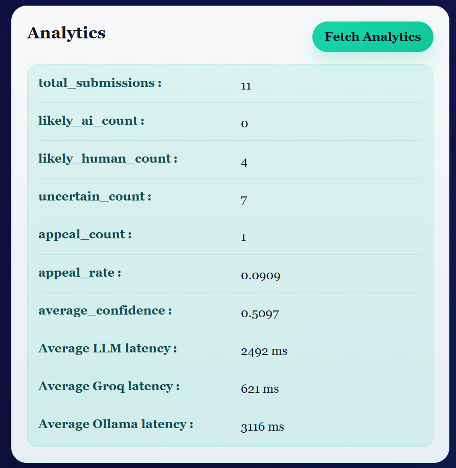
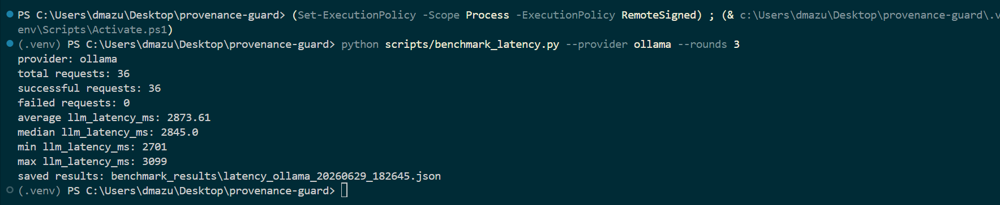

# Provenance Guard


> **Provenance Guard is an uncertainty-first AI provenance prototype.**  
> It does not claim to prove authorship. It combines multiple signals, explains uncertainty, logs decisions, and supports creator appeals.

Provenance Guard is a Flask API and browser demo that evaluates submitted writing using multiple provenance signals, combines those signals into a confidence score, returns a plain-English transparency label, supports creator appeals, and records decisions in a structured SQLite audit log.

The project is designed around a writing-platform scenario where falsely labeling a human creator’s work as AI-generated is harmful. Because of that, the system is intentionally conservative: middle-range scores become `uncertain` instead of forcing an accusation.

---

## Highlights

- Multi-signal AI provenance scoring
- Conservative uncertainty-first labeling
- Creator appeals workflow
- SQLite audit logging
- Groq cloud inference support
- Local Ollama/Qwen inference support
- Frontend provider selector for local demos
- LLM latency instrumentation
- Groq vs Ollama latency benchmarking script
- Calibration metadata explaining why a result landed where it did
- Strong AI-pattern agreement rule for obvious assistant-template text
- Browser demo frontend
- Windows-safe pytest runner
- 67 passing pytest tests

---

## Demo Preview

The frontend lets you test the full system visually instead of only through API calls.

It shows:

- attribution result
- combined confidence
- likely-AI threshold
- content ID
- transparency label
- LLM provider used
- LLM latency
- calibration details
- signal scores
- weighted signal contributions

Screenshots can be added under:

```text
docs/assets/frontend-classification.png
docs/assets/analytics-dashboard.png
```

Example Markdown:

```md


```

---

## Quickstart

Clone the repo:

```bash
git clone https://github.com/debanjawn/provenance-guard.git
cd provenance-guard
```

Create and activate a virtual environment.

Windows PowerShell:

```powershell
python -m venv .venv
.\.venv\Scripts\Activate.ps1
```

Install dependencies:

```powershell
pip install -r requirements.txt
```

Create a real `.env` file in the repo root:

```env
LLM_PROVIDER=groq
GROQ_API_KEY=your_actual_groq_key_here
GROQ_MODEL=llama-3.1-8b-instant

OLLAMA_MODEL=qwen2.5-coder:14b
OLLAMA_BASE_URL=http://localhost:11434

LLM_MAX_OUTPUT_TOKENS=80
OLLAMA_TIMEOUT_SECONDS=8
SUBMIT_RATE_LIMIT=10 per minute;50 per day
```

The repo includes `.env.example` as a safe template. Do **not** commit your real `.env`.

Run the app:

```powershell
python app.py
```

Open the frontend:

```text
http://127.0.0.1:5000/
```

Health check:

```powershell
Invoke-RestMethod http://127.0.0.1:5000/health
```

Expected response:

```json
{
  "message": "Provenance Guard API is running",
  "status": "ok"
}
```

---

## What the System Does

A text submission goes through three signals:

1. **LLM signal**  
   Uses Groq cloud inference or local Ollama/Qwen inference to judge whether the writing appears human-like, AI-like, or uncertain.

2. **Stylometric signal**  
   Measures structural writing features such as sentence length variance, vocabulary diversity, punctuation density, and repetition.

3. **Predictability signal**  
   Detects formulaic wording, generic transitions, assistant-template phrasing, and repeated high-probability phrases.

The system then combines those scores into a final confidence value and returns one of three labels:

```text
likely_human
uncertain
likely_ai
```

The goal is not to “catch” people. The goal is to provide an explainable, appealable provenance signal.

---

## Architecture

### Application Factory

The Flask app uses an application factory pattern:

```text
create_app(config=None)
```

This makes the app easier to test because each test can create an isolated app instance with its own temporary configuration.

### Submission Flow

```text
POST /submit
(raw JSON: creator_id, text, optional llm_provider)
        ↓
app.py validates input
        ↓
Generate content_id
        ↓
detectors/llm_signal.py
        ↓
detectors/stylometric_signal.py
        ↓
detectors/predictability_signal.py
        ↓
scoring.py combines weighted signals
        ↓
labels.py creates plain-English transparency label
        ↓
audit_log.py stores decision in SQLite
        ↓
JSON response with attribution, confidence, label, scores, latency, and calibration metadata
```

### Appeal Flow

```text
POST /appeal
(raw JSON: content_id, creator_reasoning)
        ↓
Validate appeal request
        ↓
Find original submission
        ↓
Record appeal with status under_review
        ↓
Store appeal in SQLite audit log
        ↓
Return appeal confirmation
```

---

## Tech Stack

- Python
- Flask
- Flask-Limiter
- Groq API
- Ollama local inference
- Qwen local model support through Ollama
- python-dotenv
- HTML/CSS/JavaScript frontend
- SQLite through Python’s built-in `sqlite3`
- pytest

---

## LLM Provider Configuration

The LLM signal supports both Groq cloud inference and local Ollama/Qwen inference.

The default provider is controlled through `.env`:

```env
LLM_PROVIDER=groq
```

or:

```env
LLM_PROVIDER=ollama
```

If `LLM_PROVIDER` is missing or invalid, the app defaults to Groq.

### Groq Cloud Inference

```env
LLM_PROVIDER=groq
GROQ_API_KEY=your_actual_groq_key_here
GROQ_MODEL=llama-3.1-8b-instant
```

### Local Ollama/Qwen Inference

Install and run Ollama, then pull the model:

```powershell
ollama pull qwen2.5-coder:14b
```

Configure `.env`:

```env
LLM_PROVIDER=ollama
OLLAMA_MODEL=qwen2.5-coder:14b
OLLAMA_BASE_URL=http://localhost:11434
```

This allows the LLM signal to run locally instead of sending the LLM prompt to a cloud provider.

### Provider Selector

The demo frontend includes a provider selector labeled:

```text
AI Provider for LLM-backed actions
```

Options:

- Default from `.env`
- Groq cloud
- Local Ollama/Qwen

This selector is intended for local demos and interviews. It does not expose API keys or secret values.

The app also exposes a safe non-secret endpoint:

```text
GET /llm-provider
```

Example response:

```json
{
  "default_provider": "ollama",
  "default_provider_label": "Local Ollama/Qwen"
}
```

---

## API Endpoints

### `GET /`

Serves the browser demo frontend.

```text
http://127.0.0.1:5000/
```

The frontend supports:

- text submission
- LLM provider selection
- transparency label output
- calibration details
- signal breakdown
- appeal submission
- audit log viewing
- analytics
- creator verification
- metadata provenance checks

---

### `GET /health`

Returns a simple health check.

```json
{
  "message": "Provenance Guard API is running",
  "status": "ok"
}
```

---

### `GET /llm-provider`

Returns safe, non-secret information about the default LLM provider.

```json
{
  "default_provider": "ollama",
  "default_provider_label": "Local Ollama/Qwen"
}
```

---

### `POST /submit`

Submits text for provenance classification.

Request:

```json
{
  "creator_id": "test-user-1",
  "text": "The sun dipped below the horizon, painting the sky in hues of amber and rose."
}
```

Optional provider override:

```json
{
  "creator_id": "test-user-1",
  "llm_provider": "ollama",
  "text": "The sun dipped below the horizon, painting the sky in hues of amber and rose."
}
```

Valid `llm_provider` values:

```text
default
groq
ollama
```

Example response:

```json
{
  "attribution": "likely_ai",
  "confidence": 0.75,
  "content_id": "ab7448fc8fff4fd0b7919fcafed116cd",
  "label": "This text shows strong signs of AI generation based on multiple signals, but this is not a final judgment. The creator may appeal this label.",
  "llm_provider": "ollama",
  "llm_latency_ms": 5728,
  "status": "classified",
  "classification_thresholds": {
    "likely_human_max": 0.39,
    "likely_ai_min": 0.75
  },
  "signal_scores": {
    "llm": 0.8,
    "stylometric": 0.2564,
    "predictability": 0.8903
  },
  "signal_contributions": {
    "llm": 0.36,
    "stylometric": 0.0769,
    "predictability": 0.2226
  },
  "calibration_summary": {
    "distance_to_likely_ai": 0.0,
    "distance_to_likely_human": 0.0,
    "calibration_rule_applied": true,
    "calibration_rule": "strong_ai_pattern_agreement",
    "explanation": "Likely AI requires a high combined score or strong agreement between elevated LLM and predictability signals, so polished writing alone can still remain uncertain.",
    "weights": {
      "llm": 0.45,
      "stylometric": 0.3,
      "predictability": 0.25
    }
  }
}
```

---

### `POST /appeal`

Submits an appeal for a previous classification.

Request:

```json
{
  "content_id": "18c3ffe225dc4e7884dcf9cbc8e4494d",
  "creator_reasoning": "I wrote this myself from personal experience. My writing style may appear more formal than typical."
}
```

Response:

```json
{
  "content_id": "18c3ffe225dc4e7884dcf9cbc8e4494d",
  "message": "Appeal received.",
  "status": "under_review"
}
```

---

### `GET /log`

Returns structured audit log entries from SQLite.

Example:

```json
[
  {
    "attribution": "likely_ai",
    "confidence": 0.75,
    "content_id": "ab7448fc8fff4fd0b7919fcafed116cd",
    "creator_id": "final-ai-test",
    "entry_type": "classification",
    "llm_score": 0.8,
    "predictability_score": 0.8903,
    "stylometric_score": 0.2564,
    "llm_provider": "ollama",
    "llm_latency_ms": 5728,
    "status": "classified",
    "timestamp": "2026-06-29T18:45:00+00:00"
  }
]
```

---

### `GET /analytics`

Returns dashboard metrics from the audit log.

Example response:

```json
{
  "appeal_count": 1,
  "appeal_rate": 0.0417,
  "average_confidence": 0.5551,
  "average_llm_latency_ms": 2874,
  "average_llm_latency_by_provider": {
    "ollama": 2874
  },
  "likely_ai_count": 1,
  "likely_human_count": 6,
  "total_submissions": 24,
  "uncertain_count": 17
}
```

---

### `POST /verify-creator`

Creates a provenance certificate for a creator.

Request:

```json
{
  "creator_id": "creator_verified_1",
  "verification_method": "writing_sample_review"
}
```

Response:

```json
{
  "certificate_label": "Verified creator: this creator completed an additional provenance check. This does not guarantee authorship of a specific submission, but it provides extra context.",
  "creator_id": "creator_verified_1",
  "timestamp": "2026-06-28T07:32:34.389878+00:00",
  "verification_method": "writing_sample_review",
  "verified": true
}
```

A verified creator is not automatically treated as human-written for every submission. This certificate is separate from the AI/human transparency label.

---

### `POST /submit-metadata`

Processes structured metadata for non-text content.

Human-process metadata example:

```json
{
  "creator_id": "metadata-human",
  "content_type": "image_metadata",
  "metadata": {
    "tool_used": "Photoshop",
    "declared_ai_assistance": false,
    "has_process_notes": true,
    "edit_history_available": true,
    "human_reviewed": true
  }
}
```

AI-assisted metadata example:

```json
{
  "creator_id": "metadata-ai",
  "content_type": "image_metadata",
  "metadata": {
    "tool_used": "Midjourney",
    "declared_ai_assistance": true,
    "has_process_notes": false,
    "edit_history_available": false,
    "human_reviewed": false
  }
}
```

---

## Detection Signals

Each signal returns a score from `0.0` to `1.0`, where higher means more AI-like.

### 1. LLM Signal

File:

```text
detectors/llm_signal.py
```

The LLM signal uses Groq by default and can optionally call a local Ollama model. It asks for a compact JSON assessment with a `score` and `reason`.

It considers:

- tone
- flow
- genericness
- semantic coherence
- polish
- whether the writing feels natural or templated
- assistant-style preambles and generic transition-heavy wording

The parser handles:

- clean JSON
- JSON inside markdown code fences
- extra text before or after a JSON object
- invalid or missing scores through fallback behavior

The LLM cannot decide the final result by itself. Its score is one part of the ensemble.

---

### 2. Stylometric Signal

File:

```text
detectors/stylometric_signal.py
```

The stylometric signal measures structural writing statistics.

It uses metrics such as:

- sentence length variance
- type-token ratio
- punctuation density
- repetition rate

AI-generated writing can be smooth and uniform, but polished human writing can also look uniform. This is why stylometrics are only one signal.

---

### 3. Predictability Signal

File:

```text
detectors/predictability_signal.py
```

The predictability signal estimates how formulaic the writing is.

It looks for:

- repeated phrases
- common transitions
- generic AI-style wording
- assistant-template preambles
- corporate phrasing clusters
- formulaic phrases like “in conclusion,” “it is important to note,” and “plays a crucial role”

Predictable writing is not automatically AI-generated. Student essays, business memos, and formal explanations may use predictable phrasing because that is normal for the genre.

---

## Confidence Scoring

The final confidence score starts as a weighted average:

```text
combined_score = (0.45 * llm_score) + (0.30 * stylometric_score) + (0.25 * predictability_score)
```

Weights:

```text
LLM signal:              45%
Stylometric signal:      30%
Predictability signal:   25%
```

Thresholds:

```text
0.00-0.39 = likely_human
0.40-0.74 = uncertain
0.75-1.00 = likely_ai
```

The `likely_ai` threshold is intentionally conservative because a false positive is more harmful than a false negative in a writing platform. Even with the demo-friendly `0.75` cutoff, likely AI still requires multiple signals to agree.

### Strong AI-Pattern Agreement Rule

There is one narrow calibration rule for obvious assistant-template cases:

```text
if llm_score >= 0.80 and predictability_score >= 0.70:
    lift final score to at least 0.75
```

This rule is reported in calibration metadata as:

```text
strong_ai_pattern_agreement
```

It does **not** trigger from the LLM alone. It requires agreement between the LLM signal and the predictability signal.

---

## Scoring Examples

### Casual Human-Like Case

```json
{
  "attribution": "likely_human",
  "confidence": 0.1726,
  "signal_scores": {
    "llm": 0.0,
    "predictability": 0.029,
    "stylometric": 0.551
  },
  "calibration_summary": {
    "calibration_rule_applied": false,
    "calibration_rule": null
  }
}
```

This stays likely human because the LLM and predictability scores are low.

---

### Obvious AI-Template Case

```json
{
  "attribution": "likely_ai",
  "confidence": 0.75,
  "signal_scores": {
    "llm": 0.8,
    "predictability": 0.8903,
    "stylometric": 0.2564
  },
  "calibration_summary": {
    "calibration_rule_applied": true,
    "calibration_rule": "strong_ai_pattern_agreement"
  }
}
```

This reaches likely AI because the LLM and predictability detector agree that the text has strong assistant-template patterns.

---

### Uncertain Case

```json
{
  "attribution": "uncertain",
  "confidence": 0.5756,
  "signal_scores": {
    "llm": 0.8,
    "predictability": 0.5548,
    "stylometric": 0.2564
  },
  "calibration_summary": {
    "calibration_rule_applied": false,
    "calibration_rule": null
  }
}
```

This remains uncertain because one signal is high, but the supporting evidence is not strong enough.

---

## Transparency Labels

### Likely Human

```text
This text appears more consistent with human-written work based on the signals reviewed. This label is not a guarantee, but the system did not find strong signs of AI generation.
```

### Uncertain

```text
We are not confident enough to determine whether this text was written by a person or generated with AI. This result should not be treated as a final judgment.
```

### Likely AI

```text
This text shows strong signs of AI generation based on multiple signals, but this is not a final judgment. The creator may appeal this label.
```

These labels avoid saying “this was written by AI” because the system is not proof of authorship.

---

## Appeals Workflow

A creator can appeal any classification by submitting the original `content_id` and their reasoning.

The system does not automatically reclassify the text. Instead, it:

1. Finds the original submission.
2. Records an appeal entry in the audit log.
3. Marks the appeal status as `under_review`.
4. Preserves the creator’s reasoning with the original classification.

A human reviewer would be able to see:

- original content ID
- creator ID
- original attribution
- original confidence
- individual signal scores
- appeal reasoning
- appeal status

---

## Audit Log

The audit log is stored in a local SQLite database and returned through the API as structured JSON.

SQLite replaced the original JSON-file audit log. This improves reliability because SQLite writes are transactional and safer than manually reading and rewriting a JSON file.

Submission entries include:

- timestamp
- content ID
- creator ID
- attribution result
- confidence score
- LLM score
- stylometric score
- predictability score
- LLM provider
- LLM latency
- status
- entry type

Appeal entries include:

- timestamp
- content ID
- creator ID
- original attribution
- original confidence
- appeal reasoning
- status: `under_review`
- entry type

---

## Analytics Dashboard

The analytics dashboard is available through:

```text
GET /analytics
```

It reports:

- total submissions
- likely human count
- uncertain count
- likely AI count
- appeal count
- appeal rate
- average confidence
- average LLM latency
- provider-specific average LLM latency

This makes it easier to inspect how the system behaves over time and compare Groq cloud inference with local Ollama/Qwen inference.

---

## Rate Limiting

The `/submit` endpoint is rate-limited with Flask-Limiter.

Default:

```text
10 per minute;50 per day
```

This protects the app from request flooding while still allowing normal writing and revision workflows.

For local benchmarking only, the limit can be temporarily raised:

```env
SUBMIT_RATE_LIMIT=200 per minute;1000 per day
```

Do not use the relaxed benchmark limit for public deployment.

---

## Latency Benchmarking

`llm_latency_ms` measures only provider inference time inside the LLM signal path, not full HTTP request time for `/submit`.

To compare Groq and local Ollama/Qwen with a broader sample set, run the Flask app first:

```powershell
python app.py
```

Then run:

```powershell
python scripts/benchmark_latency.py --provider groq --rounds 3
python scripts/benchmark_latency.py --provider ollama --rounds 3
```

The script sends a built-in batch of representative texts to the local Flask app, prints summary latency metrics, and saves timestamped JSON results under:

```text
benchmark_results/
```

`benchmark_results/` is gitignored.

Example local baseline values observed during development:

- Groq around `621 ms`
- Ollama/Qwen 14B around `3116 ms`
- Ollama/Qwen 14B after prompt/output controls around `2874 ms`

These values vary based on hardware, active model, network conditions, and prompt length.

---

## Latency Benchmark Results

Provenance Guard logs LLM provider latency for each `/submit` request. This made it possible to compare local Ollama/Qwen inference before and after prompt/output-token controls.

### Dashboard Baseline



Initial local analytics showed Ollama/Qwen 14B averaging around `3116 ms` and Groq averaging around `621 ms`.

### Local Ollama/Qwen Benchmark



After adding a shorter LLM prompt, output-token limits, and a configurable local benchmark rate limit, the Ollama/Qwen 14B benchmark completed `36/36` requests successfully with an average latency of `2873.61 ms`.

This reduced average local Ollama/Qwen latency from roughly `3116 ms` to `2874 ms`, about a `7.8%` improvement, while keeping the same `qwen2.5-coder:14b` model.

### Design Decision

I intentionally did **not** switch from `qwen2.5-coder:14b` to a smaller model such as a 7B model. A smaller model would likely reduce latency more, but it would also change the quality/latency tradeoff being measured.

Instead, I kept the same 14B local model and optimized safer application-level factors:

- shorter LLM prompt
- compact JSON-only response format
- output-token limit
- Ollama timeout fallback
- configurable benchmark rate limits

This makes the benchmark more honest: the latency improvement came from reducing avoidable overhead, not from swapping to a smaller model.

---

## Testing

The project includes a pytest suite covering unit logic, local persistence, provider selection, and API workflows.

Run tests with:

```powershell
python -m pytest
```

Recommended on Windows/local development:

```powershell
python scripts/run_tests.py
```

PowerShell convenience wrapper:

```powershell
.\scripts\run_tests.ps1
```

The helper creates a fresh unique `--basetemp` directory under the OS temp folder for each run, avoiding Windows file-lock issues with reused repo-local `.pytest-tmp*` folders.

Latest verified result:

```text
67 passed, 1 warning in 0.49s
```

Test coverage includes:

- scoring thresholds and weighted formula
- strong AI-pattern calibration rule
- transparency label selection
- stylometric detector output shape and bounds
- predictability detector output shape and AI-template ranking behavior
- metadata provenance scoring
- SQLite audit log initialization, writes, reads, and appeal entries
- LLM provider selection for Groq and Ollama
- robust LLM JSON parsing
- Ollama fallback behavior without requiring a real Ollama call
- Flask route smoke tests
- `/submit` provider override behavior
- `/appeal` workflow behavior
- `/log` route behavior
- `/analytics` route behavior
- `/verify-creator` route behavior
- `/submit-metadata` route behavior

The tests avoid real Groq and Ollama network calls by using monkeypatching and stubs.

---

## Project Structure

```text
app.py
detectors/
  __init__.py
  llm_signal.py
  stylometric_signal.py
  predictability_signal.py
templates/
  index.html
static/
  style.css
  script.js
tests/
  test_app_routes.py
  test_audit_log.py
  test_labels.py
  test_llm_signal.py
  test_metadata_signal.py
  test_predictability_signal.py
  test_scoring.py
  test_stylometric_signal.py
scripts/
  benchmark_latency.py
  run_tests.py
  run_tests.ps1
docs/
  assets/
    analytics-before.png
    ollama-benchmark-after.png
scoring.py
labels.py
audit_log.py
analytics.py
verification.py
metadata_signal.py
planning.md
requirements.txt
.env.example
.gitignore
README.md
```

---

## Known Limitations

This system is a prototype and should not be treated as a reliable AI detector.

Specific limitations:

1. **Formal human writing may be over-scored.**  
   Academic essays, business memos, and resumes can be polished and predictable, which may raise some signal scores even when the writing is human.

2. **Creative repetition can be misread.**  
   A poem or stylistic piece that repeats simple phrases may look formulaic to the predictability signal.

3. **Very short text has weak evidence.**  
   One or two sentences may not provide enough information for stylometric or predictability metrics to be meaningful.

4. **Edited AI text may become uncertain.**  
   If a person heavily edits AI-generated text, the human variation may lower the score and move the result into the uncertain range.

5. **The LLM signal is not proof.**  
   Groq and Ollama provide judgments, not ground truth. That is why the system uses multiple signals and conservative thresholds.

6. **Provider selection is for local demo/admin use.**  
   The frontend provider selector is useful for demos, but in a real deployed system, provider configuration would likely be controlled by deployment settings or admin-only controls.

7. **SQLite is lightweight, not a full production database setup.**  
   SQLite is a good upgrade over JSON-file storage for this local prototype, but a larger deployed system would likely use PostgreSQL or another production database.

If this were deployed for real users, I would add stronger calibration, human review tools, authenticated audit access, larger validation sets, stricter access controls, and clearer creator-facing explanations.

---

## Development Notes

### Post-Feedback Improvements

After the initial version of the project was submitted and graded, I made several engineering improvements:

- refactored JSON-file audit storage to SQLite
- added a Flask application factory pattern
- initialized SQLite once at app startup
- added isolated app instances in tests
- added optional local Ollama/Qwen inference
- added a frontend provider selector
- added robust model-response parsing
- added LLM latency instrumentation
- added benchmarking tools for Groq vs Ollama
- added Windows-safe test runner
- added calibration visibility and strong AI-pattern agreement logic
- expanded the test suite to 67 passing tests

### AI Tool Usage

I used AI tools as implementation support, not as a replacement for my own design decisions.

Examples of AI-assisted work:

- generating the first Flask route skeleton
- drafting detector modules from my planned architecture
- adding SQLite persistence after feedback
- expanding pytest coverage
- adding local Ollama/Qwen provider support
- improving frontend display and calibration visibility

I reviewed and tested the generated code locally before accepting changes. The final project behavior, thresholds, limitations, and conservative labeling approach were my design decisions.

---

## Rubric Coverage Summary

- Content submission endpoint: `POST /submit`
- Structured JSON response with attribution, confidence, label, and signal scores
- Multi-signal pipeline: LLM, stylometric, and predictability signals
- Confidence scoring with documented weights and thresholds
- Transparency labels for likely human, uncertain, and likely AI
- Appeals workflow through `POST /appeal`
- Appeal status changes to `under_review`
- Structured audit log through `GET /log`
- Rate limiting on `POST /submit`
- Analytics dashboard through `GET /analytics`
- Provenance certificate through `POST /verify-creator`
- Structured metadata support through `POST /submit-metadata`
- Demo frontend at `GET /`
- Optional Groq cloud inference and local Ollama/Qwen inference
- SQLite audit persistence
- Pytest coverage for core logic and API workflows